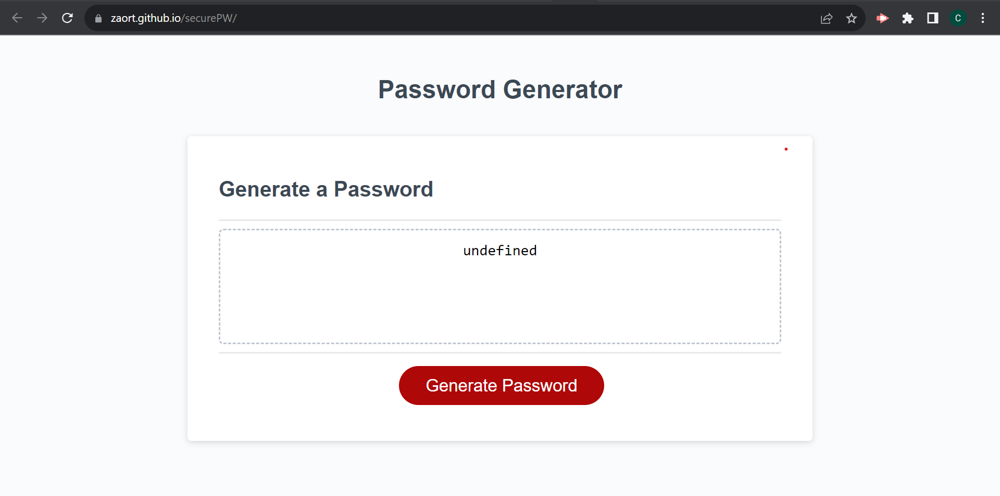

# securePW

The Generate password site has the purpose of providing the user a secure password based on some user preferences such as length and charachter types.

When the user clicks the "Generte password" button, a series of windows prompts will be presented for the user to decide the lenght and the desired charachter types on it's password.

- The length must be a number be between 8 and 128 charachters. 
- The user must at least select 1 type of the offered charachter types in order for the password to be generated.

Confirm window prompts are used for the charachter  type choices "OK = Yes | Cancel = No"

End result is the randomly and secure generated password.

